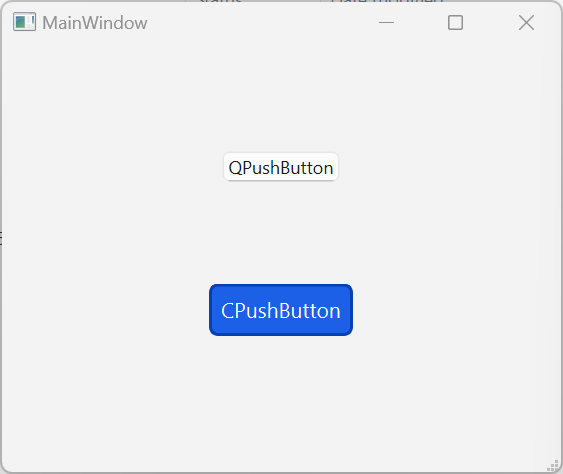

# Qt6 CMake：Qt 静态和动态库创建

项目逐渐变大，需要划分为多个模块进行开发，降低耦合性同时也方便多人开发。这时候难免需要创建静态库和动态库。本篇介绍Qt里提供的静态库和动态库创建cmake接口：qt_add_library()。
示例程序演示在窗口里显示自定义控件库里的一个按钮。工程结构如下：
```
/BuildWidgetAppWithLib ✗ tree 
|-- CMakeLists.txt
`-- src
    |-- app
    |   |-- CMakeLists.txt
    |   |-- main.cpp
    |   |-- mainwindow.cpp
    |   |-- mainwindow.h
    |   `-- mainwindow.ui
    `-- libcontrols
        |-- CMakeLists.txt
        |-- cpushbutton.cpp
        `-- cpushbutton.h
```
创建库文件
先看下库文件的cmake
```
qt_add_library(controls SHARED
    cpushbutton.cpp
    cpushbutton.h
)
target_link_libraries(controls PRIVATE Qt6::Widgets)
target_include_directories(controls INTERFACE ${CMAKE_CURRENT_SOURCE_DIR})
```
qt_add_library()函数创建了动态库，实际上是cmake里add_library()的封装，添加了一些qt的逻辑。此函数从Qt 6.2支持，原型如下：
```
qt_add_library(target
    [STATIC | SHARED | MODULE | INTERFACE | OBJECT]
    [MANUAL_FINALIZATION]
    sources...
)
```
常用的两个参数：
- STATIC：表示创建静态库
- SHARED：表示创建动态库
```
target_link_libraries(controls PRIVATE Qt6::Widgets)
```
由于库使用了QWidgets的内容，所以需要添加对应的依赖关系。
```
target_include_directories(controls INTERFACE ${CMAKE_CURRENT_SOURCE_DIR})
```
target_include_directories() 可以确保使用此库的所有目标会包含我们指定的路径，这样方便直接找到cpushbutton.h的头文件。从工程结构可以看到，cpushbutton.h是和CMakeLists.txt同目录的，所以直接添加就可以了。
```
`-- libcontrols
    |-- CMakeLists.txt
    |-- cpushbutton.cpp
    `-- cpushbutton.h
```
CPushButton 的实现比较简单，继承QPushButton，然后写下样式表实现自定义按钮。
```
#include "cpushbutton.h"

CPushButton::CPushButton(QWidget *parent)
    : QPushButton{parent}
{
    this->setStyleSheet(R"(
        QPushButton {
            background-color: #1b60e7;
            border-radius: 6px;
            color: white;
            padding: 6px;
            font-size: 14px;
            border-style: solid;
            border-width: 2px;
            border-color: #0541b2;
        }
        QPushButton:hover {
            background-color: #366ef4;
        }
        QPushButton:pressed {
            background-color: #0541b2;
        }
    )");
}
```
使用库
然后在可执行文件的项目里使用这个库
```
find_package(QT NAMES Qt6 Qt5 REQUIRED COMPONENTS Widgets)
find_package(Qt${QT_VERSION_MAJOR} REQUIRED COMPONENTS Widgets)

set(PROJECT_SOURCES
        main.cpp
        mainwindow.cpp
        mainwindow.h
        mainwindow.ui
)

qt_add_executable(BuildWidgetAppWithLib
    MANUAL_FINALIZATION
    ${PROJECT_SOURCES}
)

target_link_libraries(BuildWidgetAppWithLib PRIVATE
    controls
    Qt${QT_VERSION_MAJOR}::Widgets
)
```
只需要关注 target_link_libraries(BuildWidgetAppWithLib PRIVATE  controls...)，这里链接了 controls库，就是前面我们自定义的库。
然后在我们的源码里使用自定义控件
```
#include "mainwindow.h"
#include "./ui_mainwindow.h"
#include "cpushbutton.h"

MainWindow::MainWindow(QWidget *parent)
    : QMainWindow(parent)
    , ui(new Ui::MainWindow)
{
    ui->setupUi(this);

    auto button = new CPushButton(this);
    button->setText("CPushButton");
    button->setObjectName("cpushButton");
    ...
    ui->verticalLayout->addWidget(button, 0, Qt::AlignmentFlag::AlignHCenter);
}
组合子目标
BuildWidgetAppWithLib/CMakeLists.txt
cmake_minimum_required(VERSION 3.16)

project(BuildWidgetAppWithLib VERSION 0.1 LANGUAGES CXX)

set(CMAKE_CXX_STANDARD 17)
set(CMAKE_CXX_STANDARD_REQUIRED ON)

find_package(QT NAMES Qt6 Qt5 REQUIRED COMPONENTS Widgets)
find_package(Qt${QT_VERSION_MAJOR} REQUIRED COMPONENTS Widgets)

qt_standard_project_setup()

add_subdirectory(src/libcontrols)
add_subdirectory(src/app)

set_target_properties(BuildWidgetAppWithLib PROPERTIES
    WIN32_EXECUTABLE ON
    MACOSX_BUNDLE ON
)
```
编译运行后效果如下，
