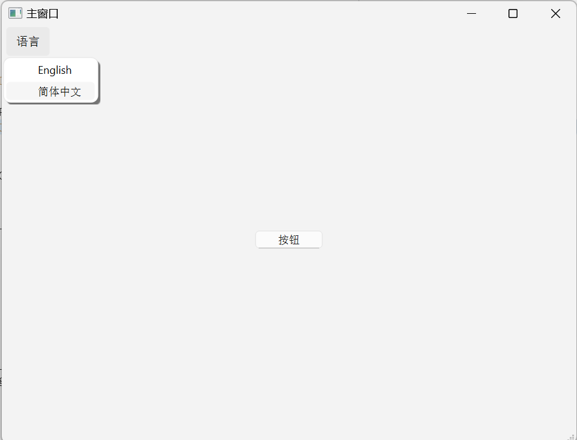

# Qt6 CMake：QWidgets 自动国际化翻译
添加翻译
Qt 项目中的字符串翻译是以.ts 文件编码的。这些.ts 文件被编译成二进制.qm 文件，然后由 Qt 应用程序在运行时加载。
本节将介绍如何在 BuildWidgetAppWithTranslations 应用程序中添加英语和中文翻译。
首先看下项目工程结构：
```
<Project root>
|-- BuildWidgetAppWithTranslations_en.ts
|-- BuildWidgetAppWithTranslations_zh_CN.ts
|-- CMakeLists.txt
|-- main.cpp
|-- mainwindow.cpp
|-- mainwindow.h
`-- mainwindow.ui
```
ts 文件是通过 CMakeLists.txt 配置后自动生成的，我们暂时不用关心。


这个项目演示了应用的中英文切换支持，在菜单栏里提供了语言选项中文和英文。更新语言选项，应用UI会更新文本显示。
源码里默认我们默认设置的字符串就是英文，所以仅需要打开BuildWidgetAppWithTranslations_zh_CN.ts 将英文字符串翻译为中文即可。cmake 同样提供了自动发布 ts文件为 qm 文件的功能。我们只需要在运行项目的时候勾选  xxx_lrelease 编译目标即可完成 qm 文件更新。
配置翻译
先看一下 CMakeLists.txt 文件：
```
cmake_minimum_required(VERSION 3.16)

project(BuildWidgetAppWithTranslations VERSION 0.1 LANGUAGES CXX)

set(CMAKE_CXX_STANDARD 17)
set(CMAKE_CXX_STANDARD_REQUIRED ON)

find_package(QT NAMES Qt6 REQUIRED COMPONENTS Widgets)
find_package(Qt${QT_VERSION_MAJOR} REQUIRED COMPONENTS Widgets)

#添加国际化工具模块
find_package(Qt6 REQUIRED COMPONENTS LinguistTools)

#配置需要的国际化的语种
qt_standard_project_setup(I18N_TRANSLATED_LANGUAGES en zh_CN)

set(PROJECT_SOURCES
    main.cpp
    mainwindow.cpp
    mainwindow.h
    mainwindow.ui
)

add_executable(BuildWidgetAppWithTranslations
    ${PROJECT_SOURCES}
)

target_link_libraries(BuildWidgetAppWithTranslations PRIVATE Qt${QT_VERSION_MAJOR}::Widgets)
```
#添加翻译文件到目标中
```
qt_add_translations(BuildWidgetAppWithTranslations)
```
#然后会自动生成ts文件，要更新翻译在build目录中执行cmake --build . --target update_translations
#或者在 QTC 中项目配置里勾选更新 xxx_lupdate 目标

上面 qt_standard_project_setup(since qt6.7) 指定了两种语言：
```
qt_standard_project_setup(I18N_TRANSLATED_LANGUAGES en zh_CN)
```
语言的字符串名称需要和 QLocale 构造函数兼容，
名称格式为 "language[_script][_territory][.codeset][@modifier]"或 "C"，其中：
- language 是小写的双字母 ISO 639 语言代码（也可识别某些三字母代码）
- script 是大写、四个字母的 ISO 15924 文字编码
- 地区是大写、两个字母的 ISO 3166 领土代码（也可识别某些数字代码）
- 代码集和修饰符将被忽略。
大家可以参考 bcp47Name。

要使用 qt_add_translations()，需要注意该命令在 Qt6 软件包的LinguistTools 组件中定义。所以提前要添加：
```
find_package(Qt6 REQUIRED COMPONENTS LinguistTools)
```
然后这个命令就可用了：
```
qt_add_translations(BuildWidgetAppWithTranslations)
```
看下这个 qt_add_translations() 的定义：
```
qt_add_translations([target]
                    [TARGETS target1 [target2...]]
                    [SOURCE_TARGETS target1 [target2...]]
                    [TS_FILE_BASE name]
                    [TS_FILE_DIR directory]
                    [TS_FILES file1.ts [file2.ts ...]]
                    [PLURALS_TS_FILE file.ts]
                    [NO_GENERATE_PLURALS_TS_FILE]
                    [RESOURCE_PREFIX prefix]
                    [OUTPUT_TARGETS variable-name]
                    [TS_FILES_OUTPUT_VARIABLE variable-name]    # since 6.8
                    [QM_FILES_OUTPUT_VARIABLE variable-name]
                    [SOURCES source1.cpp [sources2.cpp ...]]
                    [INCLUDE_DIRECTORIES directory1 [directory2 ...]]
                    [LUPDATE_TARGET target-name]
                    [LUPDATE_OPTIONS ...]
                    [LRELEASE_TARGET target-name]
                    [LRELEASE_OPTIONS ...]
                    [IMMEDIATE_CALL])
```
实际上这个命令是 qt_add_lupdate() 和 qt_add_lrelease() 的高级封装。要对.ts 文件和.qm 文件的处理方式进行更精细的控制，请使用底层命令 qt_add_lupdate() 和 qt_add_lrelease()。
一次调用解决这两个步骤。这会扫描指定 target 里面所有源码来创建 ts 文件。
在第一次配置时，该命令会在项目的源代码目录下创建BuildWidgetAppWithTranslations_en.ts 和BuildWidgetAppWithTranslations_zh_CN.ts 两个文件。这些文件将包含已翻译的字符串，并且应该和源码一同被版本控制系统管理（git、SVN...）。
该命令还创建了构建系统规则，以便从.ts 文件自动生成.qm 文件。默认情况下，.qm 文件被嵌入到一个资源中，可以通过"/i18n" 资源前缀访问。
要更新.ts 文件中的条目，请构建 update_translations 目标：
```
$ cmake --build . --target update_translations
```
随后用 QLinguist 工具打开 ts 文件翻译。
要手动触发.qm 文件的生成，请构建release_translations 目标：
```
$ cmake --build . --target release_translations
```
应用加载翻译文件
前面解决了翻译文件的生成，接下来解决动态加载 qm 文件的问题。
这里非常简单，直接从可执行程序所在目录加载 qm 文件。
```
#include "mainwindow.h"
#include "./ui_mainwindow.h"
#include <QDebug>

MainWindow::MainWindow(QWidget *parent)
    : QMainWindow(parent)
    , ui(new Ui::MainWindow)
{
    ui->setupUi(this);

    connect(ui->actionChinese, &QAction::triggered, this, [this](){
        if (translator.load("BuildWidgetAppWithTranslations_zh_CN.qm")) {
            qDebug() << "Change language to Chinese.";
            QCoreApplication::removeTranslator(&translator);
            QCoreApplication::installTranslator(&translator);
        }
    });

    connect(ui->actionEnglish, &QAction::triggered, this, [this](){
        if (translator.load("BuildWidgetAppWithTranslations_en.qm")) {
            qDebug() << "Change language to English.";
            QCoreApplication::removeTranslator(&translator);
            QCoreApplication::installTranslator(&translator);
        }
    });
}

MainWindow::~MainWindow()
{
    delete ui;
}

void MainWindow::changeEvent(QEvent *event)
{
    if (event->type() == QEvent::LanguageChange) {
        ui->retranslateUi(this);
        qDebug() << "QEvent::LanguageChange.";
    } else
        QWidget::changeEvent(event);
}
```
安装新的语言包后，QWidget将会收到一个 QEvent::LanguageChange 的事件。响应事件，刷新 UI 就会显示新的语言了。这里是 mainwindow.ui 生成的代码：
```
    void retranslateUi(QMainWindow *MainWindow)
    {
        MainWindow->setWindowTitle(QCoreApplication::translate("MainWindow", "MainWindow", nullptr));
        actionEnglish->setText(QCoreApplication::translate("MainWindow", "English", nullptr));
        actionChinese->setText(QCoreApplication::translate("MainWindow", "\347\256\200\344\275\223\344\270\255\346\226\207", nullptr));
        pushButton->setText(QCoreApplication::translate("MainWindow", "PushButton", nullptr));
        menuLanguage->setTitle(QCoreApplication::translate("MainWindow", "Language", nullptr));
    } // retranslateUi
```
实际上我们一般手写的代码大概是：
```
    void retranslateUi(QMainWindow *MainWindow)
    {
        ...
        pushButton->setText(tr("Hello world"));
        ...
    }
```